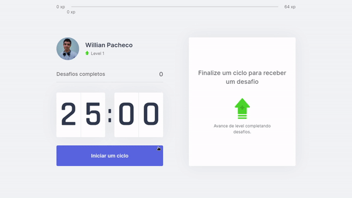

<div align="center">
    <br/>
    
    <br>
</div>
    
<br>

# Move It

<br>

The main idea of the MoveIt is to be a Pomodoro timer and help prograsmmers to be healthy sending challenges to them when the cycle ends. The MoveIt also apply the gamification concept to encourage people to make exercises and increase levels in the game while they are doing their tasks on the computer. This is a project that i did in the NLW 4 event of Rocketseat.

The application was hosted at Vercel and can be accessed at https://moveit-wps-sigma.vercel.app/

It is worth mentioning that, when cloning the repository, it is necessary to use the ```yarn``` command to load the modules and configure the application. After that, just run the ```yarn dev``` command to launch the software on localhost.

<br>